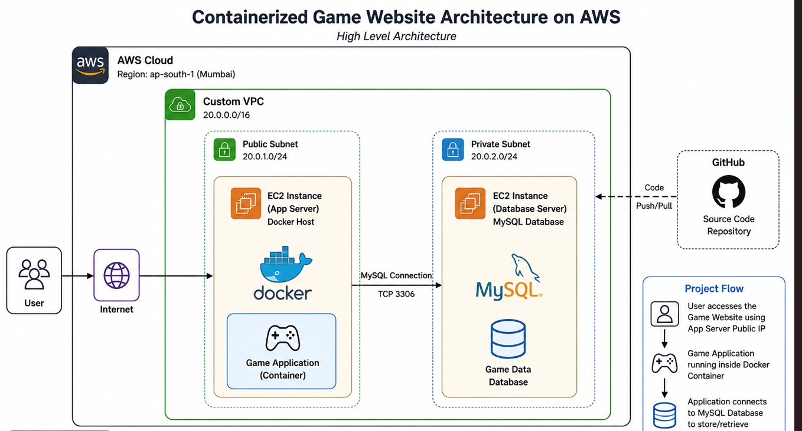
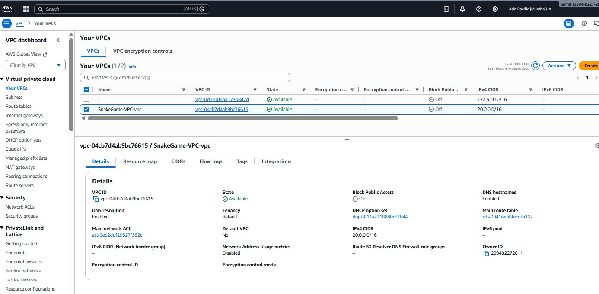
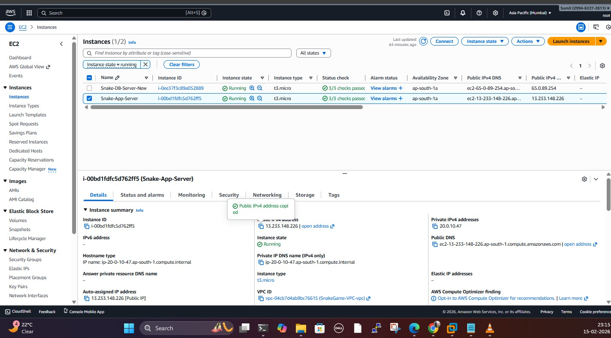
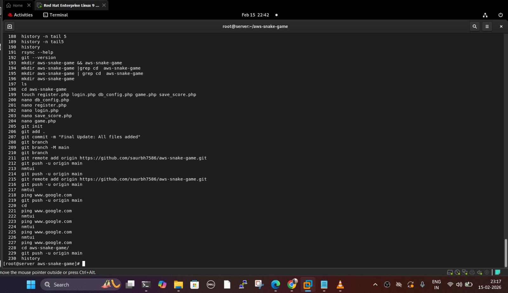
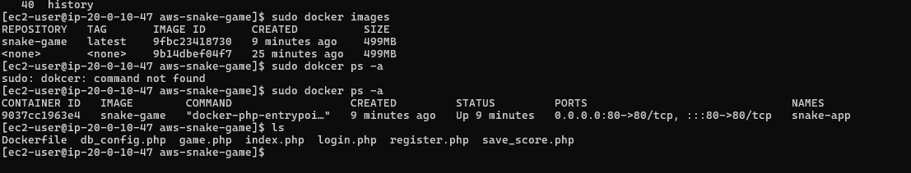
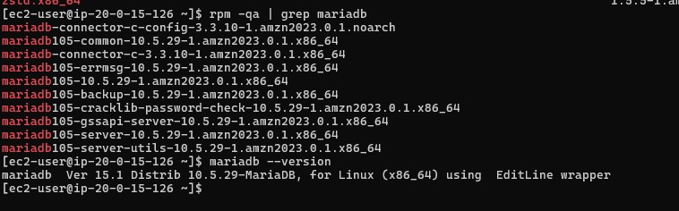
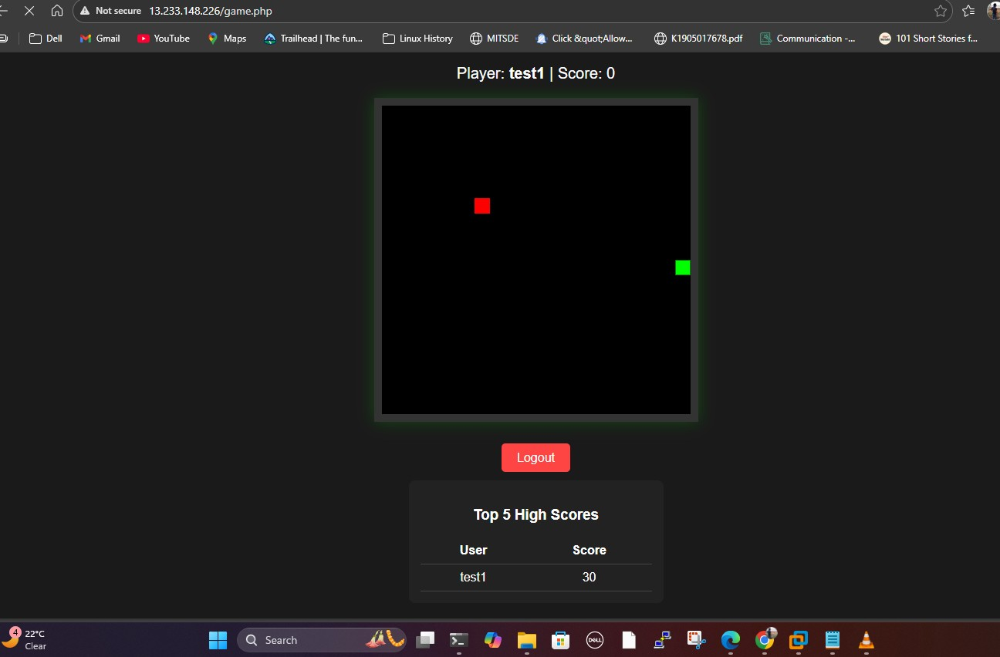

☁️ AWS Snake Game Deployment Architecture (DevOps Project)
This project demonstrates the complete deployment of a containerized Snake Game Web Application on AWS Cloud using a secure and scalable architecture. The application is deployed inside Docker containers on an EC2 instance and communicates with a separate MariaDB database server hosted on another EC2 instance.
________________________________________
📌 Project Overview
The primary objective of this project is to deploy a web-based Snake Game application on AWS by implementing industry-standard DevOps practices.
🚀 Project Highlights
•	Created a custom VPC in AWS ap-south-1 (Mumbai) region.
•	Launched two EC2 instances inside the custom VPC.
o	Application Server for hosting the Dockerized Snake Game.
o	Database Server for hosting MariaDB.
•	Pushed application source code from the local machine to GitHub.
•	Cloned the repository on the Application Server.
•	Built a Docker image using Dockerfile.
•	Deployed the application inside a Docker container.
•	Configured MariaDB database connectivity.
•	Successfully hosted the application using the EC2 Public IP.
________________________________________
🏗️ AWS Architecture Diagram

Description
This architecture illustrates the complete deployment of the Snake Game application on AWS Cloud.
The infrastructure consists of:
•	Custom VPC
•	Public Subnet
•	Internet Gateway
•	Route Table
•	Security Groups
•	EC2 Application Server
•	EC2 Database Server
•	Docker Container
•	MariaDB Database
The application is accessed through the EC2 Public IP, while the database communication takes place securely over the private network.
________________________________________
🌐 VPC Configuration

Description
A custom Virtual Private Cloud (VPC) was created to provide an isolated and secure networking environment.
The VPC includes:
•	Public Subnet
•	Internet Gateway
•	Route Table
•	Security Groups
•	Public IP for the Application Server
This setup ensures secure communication while allowing users to access the application from the internet.
________________________________________
🖥️ Application & Database Server

Description
The infrastructure contains two EC2 instances.
Application Server
•	Ubuntu Linux
•	Docker Installed
•	Git Installed
•	Snake Game running inside Docker Container
Database Server
•	MariaDB Installed
•	Database configured
•	Remote database connectivity enabled
•	Connected securely with the Application Server
________________________________________
📥 GitHub Repository

Description
The application source code was pushed to GitHub from the local machine and cloned on the EC2 Application Server.
git clone https://github.com/your-username/your-repository.git
cd your-repository
________________________________________
🐳 Docker Deployment

Description
Docker was installed on the Application Server.
The application image was built using Dockerfile and deployed inside a Docker container.
sudo apt update

sudo apt install docker.io -y

sudo systemctl enable docker

sudo systemctl start docker

docker build -t snake-game .

docker run -d -p 80:80 snake-game
________________________________________
🗄️ MariaDB Installation

Description
MariaDB was installed and configured on a dedicated EC2 Database Server.
Configuration includes:
•	Database creation
•	User creation
•	Granting privileges
•	Remote connectivity
•	Application database integration
________________________________________
🌐 Network Flow
User
   │
   ▼
Internet
   │
   ▼
Internet Gateway
   │
   ▼
Route Table
   │
   ▼
EC2 Application Server
   │
   ▼
Docker Container
   │
   ▼
MariaDB Database Server
   │
   ▼
Application Response
________________________________________
🔐 Security Configuration
Security Groups
Service	Port
HTTP	80
HTTPS	443
SSH	22
MariaDB	3306 (Allowed only from Application Server)
Security Best Practices
•	SSH access restricted to trusted IP addresses.
•	Database server is not publicly accessible.
•	Secure communication between Application Server and Database Server.
•	Least Privilege Principle followed.
________________________________________
🛠️ Technologies Used
•	Amazon Web Services (AWS)
•	Amazon EC2
•	Amazon VPC
•	Internet Gateway
•	Route Tables
•	Security Groups
•	Docker
•	MariaDB
•	Git
•	GitHub
•	Ubuntu Linux
________________________________________
🚀 Deployment Steps
1.	Create a Custom VPC.
2.	Configure Public Subnet.
3.	Attach Internet Gateway.
4.	Configure Route Tables.
5.	Launch Application Server EC2 Instance.
6.	Launch Database Server EC2 Instance.
7.	Install Docker.
8.	Clone GitHub Repository.
9.	Build Docker Image.
10.	Run Docker Container.
11.	Install and Configure MariaDB.
12.	Connect Application with Database.
13.	Test the Application using EC2 Public IP.
________________________________________
📸 Project Screenshots
🏗️ AWS Architecture Diagram

________________________________________
🌐 VPC Configuration

________________________________________
🖥️ Application & Database Server

________________________________________
📥 GitHub Clone & Deployment

________________________________________
🐳 Docker Build & Deployment

________________________________________
🗄️ MariaDB Installation

________________________________________
🎮 Final Website Output

________________________________________
🐍 Snake Game Preview

________________________________________
🎯 Key Learnings
•	AWS VPC Design
•	EC2 Provisioning
•	Docker Containerization
•	MariaDB Database Configuration
•	Git & GitHub Workflow
•	Linux Server Administration
•	Secure Networking
•	End-to-End Cloud Deployment
________________________________________
🔮 Future Enhancements
•	CI/CD Pipeline using Jenkins
•	GitHub Actions Integration
•	AWS RDS Migration
•	Elastic Load Balancer (ELB)
•	Auto Scaling Group (ASG)
•	Kubernetes (Amazon EKS)
•	AWS CloudWatch Monitoring
________________________________________
👨‍💻 Author
Saurabh Suryawanshi
Cloud & DevOps Engineer (Learner)
Skills: AWS • Linux • Docker • Git • GitHub • MariaDB • Networking

